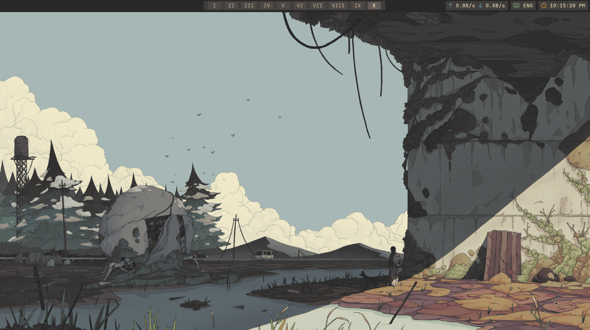

<div align="center">

[](https://git.io/typing-svg)


</div>



##

### Applications:

|                         |                NixOS 24.05                 |
| ----------------------- | :----------------------------------------: |
| **Desktop Environment** |      [Hyprland](https://hyprland.org)      |
| **Terminal Emulator**   |   [Foot](https://codeberg.org/dnkl/foot)   |
| **Display Server**      | [Wayland](https://wayland.freedesktop.org) |

### Directory Structure

```
├── home
│  ├── programs
│  │   ├── foot
│  │   └── hyprland
│  └── home.nix
├── nixos
│  ├── configuration.nix
│  └── hardware-configuration.nix
├── flake.nix
└── install.sh
```

### Installation

0. Clone the repo:

```bash
git clone https://github.com/CofymDD/.dotfiles.git ~/
```

1. Run installation script:

```bash
cd ~/.dotfiles
```

```bash
chmod +x install.sh
```

```bash
./install.sh
```

##

<div id="header" align="center">
    <a href="https://cofymdd.com">
        
    </a>
    <h3>CofymDD</h3>
</div>
